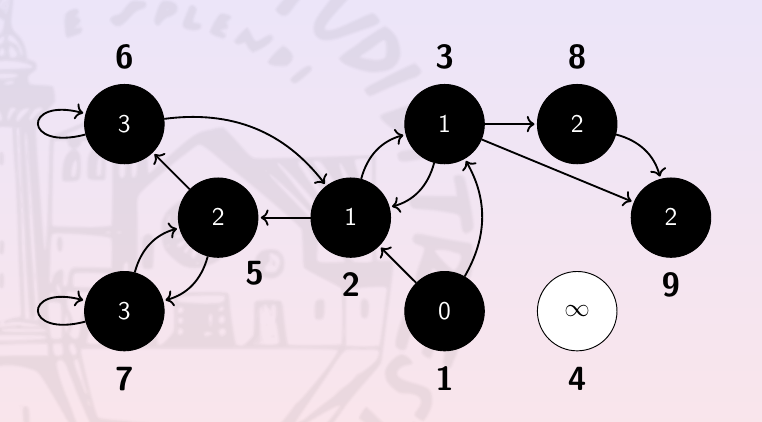
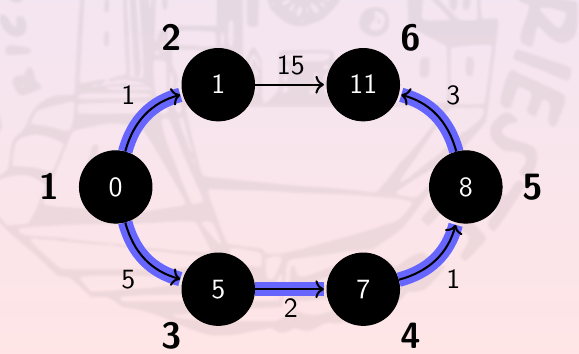
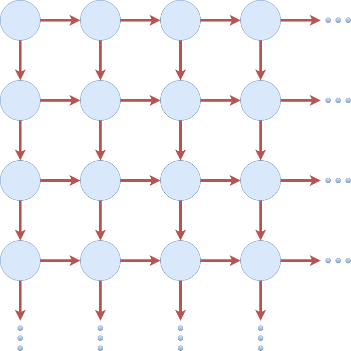

# Weighted Graphs: Dijkstra algorithm (binheap-based version)

In this repository it is implemented the Dijkstra algorithm. The queue is implemented by using and binheap-representation.

## Compile

`gcc test.c -o test -std=c99 -Wall -Wextra -lm -O3`

In case if is necessary to debug, it should be used the following command:

`gcc test.c -o test -std=c99 -Wall -Wextra -lm -g`

* **Compiler version:** This code has been compiled with gcc 9.3.0.

## Source code

The code (since it has not been compiled by using CMake) has been separated into several libraries and a main file called `test.c`. The files in which the code is divided are the following:

* `binheap.h`: Library which contains an binheap-based implementation. The code contained in the library is the same contained in the exercise of binheap. Note that it has been used the array-indexes version  of binheap implementation. Since the nodes contains pointers to other nodes, it is necessary that nodes are fixed in memory: If nodes addresses changes the pointers of `link` does not make sense any more. For this reason the original binheap implementation would not work in this case. The second implementation of binheap keep the nodes fixed in memory (changing only the arrays associated with the indexes), so it works properly with `graph_type`.
* `graph.h`: Library which contains the support for the graph and the necessary functions to construct, use and interact with a graph. Further information is available in other section.
* `SSSP.h`: Library which contains the Single Source Shortest Path implementation by using the Dijkstra's algorithm.
* `total_orders.h`: Library which contains some order operators. It is the same library of the previous exercises with one additional operator that compares node's distances.
* `test.c`: This is the main source file. It contains some tests for the mentioned implementations. There are two tests that check whether the algorithm works correctly and also a performance test. Further details in the dedicated section.

## Graph implementation

In order to implement the graph it has been implemented a couple of structs. The first one represents a single node of the graph and the second one represents the entire graph basing on the node struct. The idea is to organize the graph in a sort of microscopical-macroscopical prospective.

* `node_type`:  This is the struct for the single node. For understeibility reasons, weights and distances has been taken as `unsigned int` variables. It could be codified as `void` pointers such as the key, but it could obfuscate the code a lot. Edges are codified in the variable `link` by using pointers to the corresponding nodes. The number of edges connected to a single node is limited by `max_link`, which is provided in the initialization of the node.
* `graph_type`: This struct holds the entire graph. Nodes are codified into an array of `node_struct`, `N`. The struct contains a `total_order_type` operator `leq`. Note that this operator is not an operator between usual variable types but among nodes. This implementation uses `leq_node`, which compares two nodes by comparing its distances.

## Tests

In the main file `test.c` three tests are provided. The first two tests are graphs taken from the slides (and whose result is well-known) and the third graph is a squared graph in which both the edges and the nodes grows linear with `n` (`n` is the number of nodes). 

* Graph 00:

* Graph 01:

* Graph for performance:

The performance test evaluates the mean time taken by 10 instances of Dijkstra's algorithm.