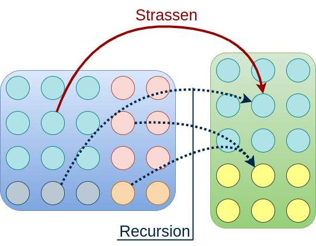
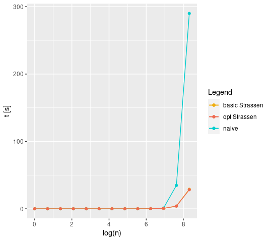

# 02_homework

Here it can be found a brief explanation about the solution of the exercises. Implementations can be found on the source files of [`AD_strassen_template`](../../AD_strassen_template): `strassen.c` and `strassen_optimized.c`. `test.c` has been modified in order to include a version of the code with the improvement suggested on exercise 2. In the current implementation, it has been taken a threshold of `n=100` in order to use the naive algorithm or Strassen's algorithm.

## Exercise 1

**Generalize the implementation to deal with non-square matrices.**

The Strassen's algorithm can not be generalized itself: it can be generalized the recursion structure in order to multiply non-square matrices exploiting Strassen's algorithm. In this case the strategy followed is to identify in both matrices a square maximal block of the same dimensions and then apply Strassen's algorithm to multiply them. The rest of non-square products are multiplied by using recursion, repeating the same process. The next image shows this strategy:

## Exercise 2

**Improve the implementation of the Strassen's algorithm by reducing the memory allocations and test the effects on the execution time.**

In the algorithm, there are two arrays of matrices that are used: **S** and **P** (with slides notation). Each one of these matrices are allocated every recursion call. A possibility could be to use the same **P** for all recursion calls. Each call of the algorithm contains 7 further recursion calls which allocates 7 new **P** matrices. The improvement in this case is to use the same **P** matrices for all the 7 calls with one single call to `malloc()`, avoiding the rest of calls.

## Performance test

Here there are both semilog and log-log representations:

As it can be seen, it is a notable difference between the naive and Strassen algorithms. However, the difference with the optimized version of the algorithm is such little. Moreover, with a such big value of n, it possibly could be observed some difference. 