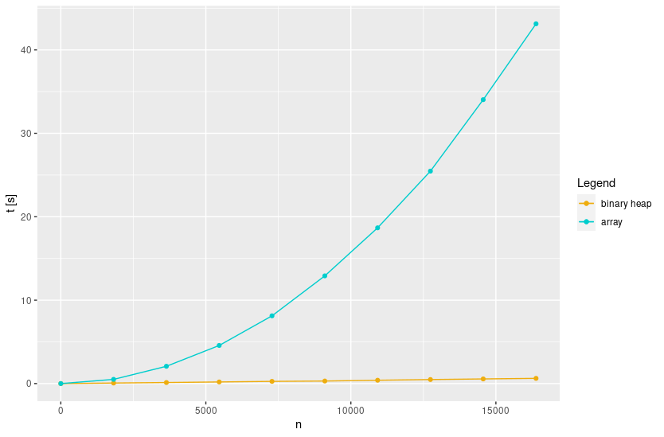
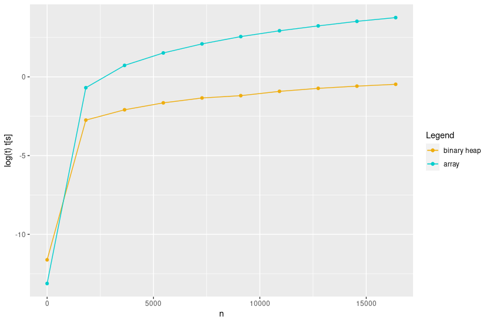
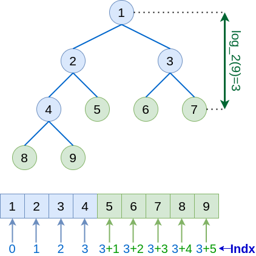
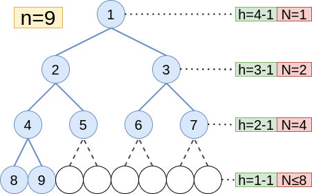

# 04_homework

Here it can be found a brief explanation about the solution of the practical exercises and the solutions for theoretical exercises. The code can be found on [`AD_bin_heaps`](../../AD_bin_heaps): the implemented code is available in [`src/binheap.c`](../../AD_bin_heaps/src).

## Exercise 1

**Implement the array-based representation of binary heap together with the functions $HEAP\_MIN,\ REMOVE\_MIN,\ HEAPIFY,\ BUILD\_HEAP,\ DECREASE\_KEY$  and $INSERT\_VALUE$. **

Implementation available in `src/binheap.c`.

## Exercise 2

**Implement an iterative version of $HEAPIFY$**.

The implementation of $HEAPIFY$ in the exercise 1 is iterative. Available in `src/binheap.c`.

## Exercise 3 (performance test)

**Test the implementation on a set of instances of the problem and evaluate the execution time.**

Execution times have been tested for a linear set of `n`. 

As it can be seen, the improvement in the performance is appreciable, enough to confirm (visually) the different orders in terms of $\Theta$ among both algorithms.

## Exercise 4

**Show that, with the array representation, the leaves of a binary heap containing $n$ nodes are indexed by $[n/2]+1,[n/2]+2,...n$.**

Let us start by recalling the definition of leave: a leave is defined as any node s.t. no other nodes are children of it. Since the array is ordered from the root to the leaves, the target is to identify the first node without children (or the last node with children). The rest of the nodes behind of it must be leaves.

Above there is a graphical example of the strategy to follow. The first step is to set a condition that implies non-leave status: every node not having a left children is leave. This is true because a node with right children necessarily must have left children, since the support array must be ordered. Since each level of the heap duplicates the number of elements of the previous level, for every node (with children) of index $i$, it must be true that:
$$
\mathsf{Left\_child}([i])=[2i]
$$
By considering this relationship, we can think to what is the last possible children of the tree: it must be the last node, $[n]$. It can be integrated the previous relation:
$$
[2i']=[n] \Rightarrow \mathsf{Left\_child}([i'=n/2])=[n]
$$
Since the last possible left-child is $[n]$, the last possible "father" must be $[i'=n/2]$, being the nodes that follows it $[n/2]+i$ necessarily leaves. Thus, concluding, leaves must follow the next rule:
$$
[n/2]+i, \quad i={1,..., n/2}
$$

## Exercise 5

**Show that the worst-case running time of $\mathsf{HEAPIFY}$ on a binary heap of size $n$ is $\Omega(\log n)$. (Hint: For a heap with $n$ nodes, give node values that cause $\mathsf{HEAPIFY}$ to be called recursively at every node on a simple path from the root down to a leaf.)**

This fact can be shown by evaluating the pseudo-code of $\mathsf{HEAPIFY}$. For this purpose we will assume that we are exactly in the worst case i.e. the loop over nodes will be of maximum distance. Let us take a look to the pseudocode:
$$
\begin{aligned}
&a \leftarrow \mathrm{root} ......................\Theta(h)+c \\
&\mathrm{WHILE}(!\mathsf{Is\_leave}(a)).......... \ \Theta(1) \\
& \ \ \ b \leftarrow \mathsf{Children}(a, left\_right)...\Theta(1) \\
& \ \ \ \mathsf{Swap}(a, b)................... \ \Theta(1) \\
& \ \ \ a \leftarrow b ........................\Theta(1)\\
&\mathrm{ENDWHILE}
\end{aligned}
$$
By taking a look to this algorithm, it is clear that complexity must be $\Theta(h) \Rightarrow \Omega(h)$ (Note that here we are assuming the worst case, by considering the general algorithm without this assumption it would be more appropriate to use the big O notation, associated with the upper limit: $O(h)$).

As seen at lesson, the height of the tree is given by $h=\log_2(n)$. This is by the fact that the elements on the tree grows with base 2-exponential shape. The final time-complexity for the worst case is:
$$
\Omega(\log(n))
$$

## Exercise 6

**Show that there are at most $[n/2^{h+1}]$ nodes of height $h$ in any $n$-element binary heap.**

It can be easily shown by induction. Let us call $m_h$ the number of nodes at the level $h$. First of all it is important to recall a couple of facts about the number of elements of the different levels:

* Each level of the heap have the double of elements than the previous one because of the fact that the heap is binary: 

$$
m_h=m_{h-1}/2 \equiv r(m_{h-1})
$$

​		Since it is a recursive formula, for now we will use the notation $m_h \equiv r(m_h)$.

* Because of the previous fact, the base level can contain, at most, half of the elements: 

$$
m_1 \leq n/2 
$$

Note that, for understandability, we are using indexes from 1 to $log_2(n)$ for now. 

Then it can be proposed the next formula in order to explain the number of elements of each level:
$$
m_h=\frac{n}{2^h}, \quad h=1,...,\log_2n
$$
Now we can show by using induction the validity of the formula by checking the two lemmas:

* $m_1=n/2$: This is trivially correct for the full case, which is the one requested.
* $m_{h+1} = r(m_h)$: Introducing the proposed formula in the recursive relation we have that

$$
r(m_h)=m_h·\frac{1}{2}=\frac{n}{2^h}·\frac{1}{2}=\frac{n}{2^{h+1}}=m_{h+1}
$$

With the lemmas verified, it is shown the correctness of the proposed formula. It only remain to shift the formula by one position in order to take the index of the base level as $h=0$:
$$
m_h=\frac{n}{2^{h+1}} \quad h=0,...,\log_2(n)-1
$$
