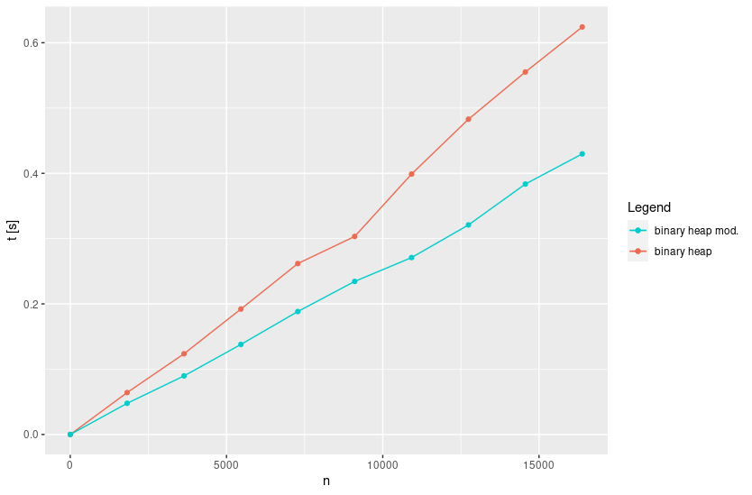
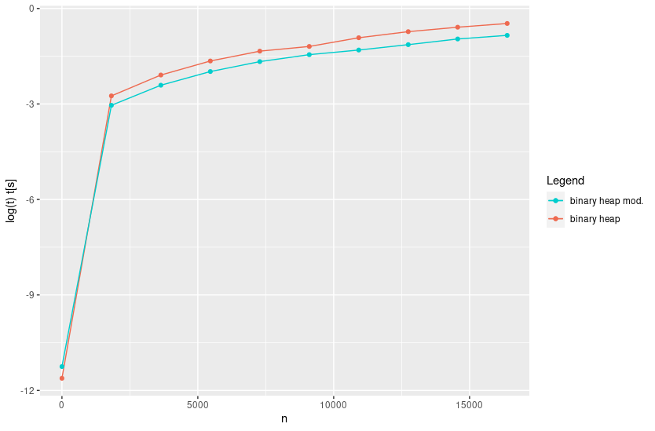

# 04_homework_2

Here it can be found a brief explanation about the solution of the practical exercises and the solutions for theoretical exercises. The code can be found on [`AD_bin_heaps_modified`](../../AD_bin_heaps_modified): the implemented code is available in [`src/binheap.c`](../../AD_bin_heaps_modified/src).

## Exercise 1

**By modifying the code written during the last lessons, provide an array-based implementation of binary heaps which avoids to swap the elements in the array $\mathsf{A}$.**

**(*Hint*: use two arrays, $\mathsf{key\_pos}$ and $\mathsf{rev\_pos}$, of natural numbers reporting the position of the key of a node and the node corresponding to a given position, respectively)**

The code has been implemented in [`AD_bin_heaps_modified`](../../AD_bin_heaps_modified). At the end of this report it can be found the comparison in terms of performance between the two implementations of the binary heaps.

## Exercise 2

**Consider the next algorithm:**
$$
\begin{align}
&\mathsf{def \ Ex2(A)} \\
&\quad \mathsf{D \leftarrow build(A)} \\
\\
&\quad \mathsf{while \ \neg \ is\_empty(D)} \\
&\quad \quad \mathsf{extract\_min(D)} \\
&\quad \mathsf{endwhile} \\
&\mathsf{enddef}
&\end{align}
$$
**where $\mathsf{A}$ is an array. Compute the time-complexity of the algorithm when:**

* $\mathsf{build}$, $\mathsf{is\_empty}\in \Theta(1)$, $\mathsf{extract\_min}\in \Theta(|D|)$;
* $\mathsf{build}\in \Theta(|A|)$, $\mathsf{is\_empty}\in \Theta(1)$, $\mathsf{extract\_min}\in O(\log|D|)$;

First of all, note that the while loop is executed $|A|$ times. By considering it, we can start to analyze the first case.

- First case: 

As said in the text, $\mathsf{build}$ is not inside a loop so it adds to the total complexity a cost of $T_{\mathsf{build}}=\Theta(1)$. Then there is a loop that is executed exactly $|A|$ times (the initial size of the heap). Every time it is checked a condition with cost $\Theta(1)$.

Inside the while loop it is a function, $\mathsf{extract\_min}$, whose cost depends on the current size of the heap, $|D|$. This size variates since we are extracting exactly one element from the heap every time. By considering this fact and the cost of the loop checking condition, we could construct a expression for the time complexity by taking account of every single iteration of the loop:
$$
T_{\mathsf{loop}}=\Theta(|A|+(|A-1|)+(|A-2|)+...+(1))+\Theta(|A|), \quad |A| \ \mathrm{times}
$$
Note that the last term $\Theta(|A|)$ correspond to the time-complexity of the loop condition. It can be simplified to:
$$
T_{\mathrm{loop}}=\Theta \left(|A|^2-\sum_{i=1}^{|A|}i\right) + \Theta(|A|)
$$
The previous sum has analytical solution, so operating we obtain:
$$
T_{\mathrm{loop}}=\Theta \left(\frac{1}{2}|A|^2+|A|+\frac{1}{2} \right)
$$
Now we can retrieve all the terms and compute the total time complexity:
$$
T=T_{\mathsf{build}} + T_{\mathrm{loop}} = \Theta(1) + \Theta(\frac{1}{2}|A|^2+|A|+\frac{1}{2}) = \Theta(|A|^2)
$$

- Second case:

This case is similar to the previous one with two differences: the first is that $T_{\mathsf{loop}}=\Theta(|A|)$. The second is that $\mathsf{extract\_min}$ is given in terms of big O instead of big $\Theta$, so the general expression is:
$$
T=T_{\mathsf{build}} + T_{\mathrm{loop}} = \Theta(|A|) + O(\frac{1}{2}|A|^2+\frac{1}{2}) + \Theta(|A|)
$$
With this expression, the only possibility is to give a time complexity only in terms of big O:
$$
T=O(|A|^2)
$$

## Performance test

The performance test has been made over the same instances that the first implementation of the binary heaps. Both implementations can be compared in the plots.

We can note that, in spite of the fact that the improvement on the performance is appreciable, is not enough to imply an improvement in terms of time-complexity: $\mathsf{swap}$ is $\Theta(1)$ on both implementations.