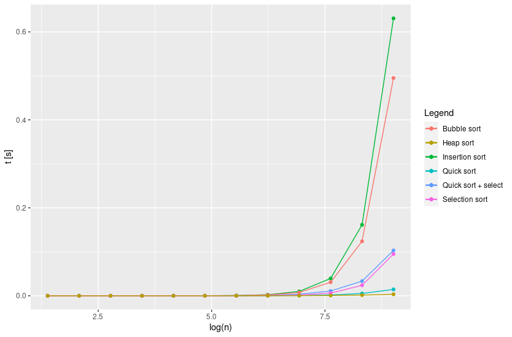
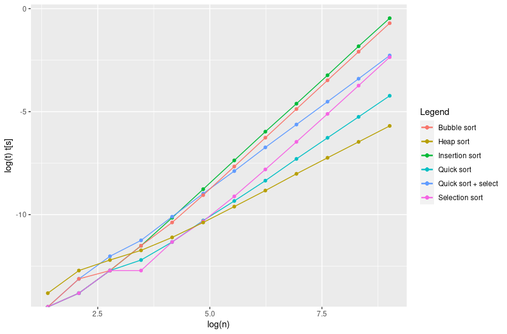
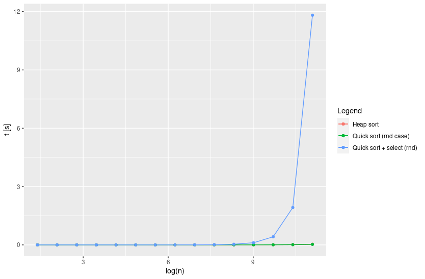
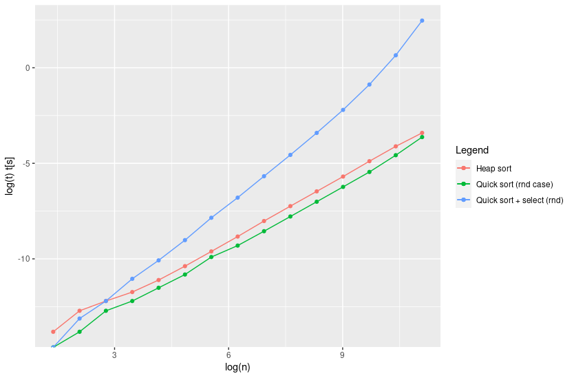

# 05_homework

Here it can be found a brief explanation about the solution of the practical exercises and the solutions for theoretical exercises. The code can be found on [`AD_sorting`](../../AD_sorting/): the implemented code is available in the folder [`src`](../../AD_sorting/src), split in the files: [`bubble_sort.c`, `insertion_sort.c`, `quick_sort.c`, `selection_sort.c`, `total_order.c`, `heap_sort.c` and `select.c`](../../AD_sorting/src).

## Exercise 1

**By using the code at:** https://github.com/albertocasagrande/AD_sorting

**implement $\mathrm{INSERTION\ SORT}$, $\mathrm{QUICK\ SORT}$, $\mathrm{BUBBLE\ SORT}$, $\mathrm{SELECTION\ SORT}$ and $\mathrm{HEAP\ SORT}$.**

The code is available at [`AD_sorting/src`](../../AD_sorting/src).

## Exercise 2 (performance test)

**For each of the implemented algorithm, draw a curve to represent the relation between the input size and the execution-time.**

The plots have been divided into two couples: the general plot, comparing all the algorithms, and two specific plots that compares the heaps and quick sort, with more instances. Note that it has been plot, in general, the worst-cases time-complexities except when it is specified.

* Shorter plot (all the algorithms):

* Longer plot (with heaps and quick sort):

The most relevant feature of the plots is that, at least in the instances in which the algorithm has been tested, is that the use of $\mathrm{SELECT}$ provide a worse result than $\mathrm{QUICK\ SORT}$. It could be due to an excess of memory allocation requests. Maybe it could improved the implementation by trying to reduce the amount of memory allocated in the $\mathrm{SELECT}$ algorithm.

## Exercise 3

**Argue about the following statement and answer the questions**

* **(a) $\mathrm{HEAP\ SORT}$ on a array $A$ whose length is $n$ takes time $O(n)$.**
* **(b) $\mathrm{HEAP\ SORT}$ on a array $A$ whose length is $n$ takes time $\Omega(n)$.**
* **(c) What is the worst case complexity for $\mathrm{HEAP\ SORT}$.**
* **(d) $\mathrm{QUICK\ SORT}$ on a array $A$ whose length is $n$ takes time $O(n^3)$.**
* **(e) What is the complexity of $\mathrm{QUICK\ SORT}$?**
* **(f) $\mathrm{BUBBLE\ SORT}$ on a array $A$ whose length is $n$ takes time $\Omega(n)$.**
* **(g) What is the complexity of $\mathrm{BUBBLE\ SORT}$? **

Let us provide a discussion to the different questions:

* **(a) $\mathrm{HEAP\ SORT}$ on a array $A$ whose length is $n$ takes time $O(n)$.**

This can be easily checked by over-viewing the pseudo-code of $\mathrm{HEAP\ SORT}$:
$$
\begin{align}
&\mathsf{Build\_heap}(A)................\Theta(n)\\
&\mathrm{WHILE}(!\mathsf{Heap\_empty}(A)).....\Theta(1) \ [\mathrm{n\ times}] \\
&\quad i \leftarrow \mathrm{index}...................\Theta(1) \\
&\quad a \leftarrow \mathsf{Extract\_min}(A).........O(\log(n)) \\
&\quad A[i] \leftarrow a....................\Theta(1)

\end{align}
$$
Note that $\mathsf{Build\_heap}$ is (in particular) $\Omega(n)$ due to the presence of $\mathsf{Find\_the\_max}$, which search the maximum value of $A$ on time $\Theta(n)$.

Considering these complexities, it is clear that the overall complexity must be:
$$
T=T_{\mathrm{build}}+T_{\mathrm{loop}}=\Theta(n)+O(n\log n) \\ T=O(n\log n)
$$
 Thus, the affirmation is true, since $O(n \log n)$ is upper bound for $O(n)$, but useless since it provide a non-realistic information.

**(b) $\mathrm{HEAP\ SORT}$ on a array $A$ whose length is $n$ takes time $\Omega(n)$.**

A similar procedure to the previous question can be done, this time by taking $\Omega$ notation.

$$
\begin{align}
&\mathsf{Build\_heap}(A)................\Theta(n)\\
&\mathrm{WHILE}(!\mathsf{Heap\_empty}(A)).....\Theta(1) \ [\mathrm{n\ times}] \\
&\quad i \leftarrow \mathrm{index}...................\Theta(1) \\
&\quad a \leftarrow \mathsf{Extract\_min}(A).........\Omega(1) \\
&\quad A[i] \leftarrow a....................\Theta(1)

\end{align}
$$
The only change is in the complexity of $\mathsf{Extract\_min}$, enough to change $T_{\mathrm{loop}}$:
$$
T=T_{\mathrm{build}}+T_{\mathrm{loop}}=\Theta(n)+\Omega(n) \\ T=\Omega(n)
$$
being in this case the affirmation true.

* **(c) What is the worst case complexity for $\mathrm{HEAP\ SORT}$.**

In this case the worst-case complexity corresponds to the one of the question **(a)**, which is the only question in which worst-case assumptions have been made.

* **(d) $\mathrm{QUICK\ SORT}$ on a array $A$ whose length is $n$ takes time $O(n^3)$.**

The worst case is the one in which the pivot is the greatest (or smallest) element, so all the array must be ran up to find the pivot position. In this case it is a recurrence relationship like:
$$
T(n)=T(n-1)+\Theta(n)
$$
By iterating it we obtain:
$$
T(n)=\Theta(n)+\Theta(n-1)+\Theta(n-2)+...+\Theta(1)= \\
=\sum_{i=1}^{n} \Theta(i)=\Theta(\frac{n(n-1)}{2})= \\
= \Theta(n^2)
$$
Since $O(n^3)$ is an upper bound for $O(n^2)$, the affirmation is true but useless, we have a more precise upper bound.

* **(e) What is the complexity of $\mathrm{QUICK\ SORT}$?**

The worst-case complexity has been discussed in the previous question, remaining to analyze the best-case complexity.

The best case is given when every time, the pivot is chosen in a balanced way i.e. the half of the array is greater and the half smaller. This provide the next recurrence relation:
$$
T(n)=2T(n/2)+\Theta(n)
$$
Again it can be iterated:
$$
T(n)=2T(n/2)+\Theta(n)=2^3T(n/2^3)+2^2\Theta(n/2^2)+2\Theta(n/2)+\Theta(n)= \\
= \sum_{i=1}^l 2^i \Theta(n/2^i) = \sum_{i=1}^l \Theta(n)
$$
Now we have to find the upper limit of the sum, $l$. Looking at the argument of $\Theta$, we can observe that there is a fraction of the total length of the array, $n$. We know that the minimum possible fraction of $n$ is one single element. This imposes a constraint enough to obtain $l$:
$$
\frac{n}{2^l}=1 \Rightarrow l=\log_2(n)
$$
The limit can be integrated in the sum:
$$
T(n)=\sum_{i=1}^{\log_2n} \Theta(n) = \Theta(n \log n)
$$
By considering the best and the worst cases as downer and upper limits respectively for the execution time, the complexity of $\mathrm{QUICK\ SORT}$ can be characterized with:
$$
O(n^2), \quad \Omega(n\log n)
$$

* **(f) $\mathrm{BUBBLE\ SORT}$ on a array $A$ whose length is $n$ takes time $\Omega(n)$.**

Since $\mathrm{BUBBLE\ SORT}$ contains two nested loops: the one that select every element and the one that set each element to its position, $\mathrm{BUBBLE\ SORT}$ cannot perform the ordination in linear time, in fact, the algorithm is $\Theta(n^2)$ as seen at lesson. However, $\Omega$ notation provide a downer limit, so $\Omega(n)$ is suitable to characterize the algorithm, but unrealistic.

* **(g) What is the complexity of $\mathrm{BUBBLE\ SORT}$? **

As mentioned in the previous question, $\mathrm{BUBBLE\ SORT}$ have  complexity $\Theta(n^2)$. This can be verified taking a look to its pseudo-code. The first loop runs $n$ times while the second runs up to the last ordered element, so the recurrence relation is:
$$
T(n)=\Theta(n)+T(n-1)
$$
This is the same recurrence relation than the one of $\mathrm{QUICK\ SORT}$'s worst-case (see question **(d)**), that boils down the time complexity $\Theta(n)$.

## Exercise 4

**Solve the following recursive equation:**
$$
T(n)=
\begin{cases}
\begin{align}
	&\Theta(1) &\mathrm{if} \ n=32 \\
	&3T(\frac{n}{4})+\Theta(n^{3/2}) &\mathrm{otherwise}
\end{align}
\end{cases}
$$
The second equation can be interpreted like a recursion relationship while the first one can be seen as a boundary condition to the second one. It can be solved by using the substitution method. The first step is to iterate the recursive equation and find a general expression:
$$
3T(\frac{n}{4})+\Theta(n^{3/2})=\Theta(n^{3/2}) + 3\Theta \left( \left(\frac{n}{4}\right)^{3/2}\right) + 3^2\Theta \left( \left(\frac{n}{4^2}\right)^{3/2}\right) + ... = \\ = \sum_{i=1}^{l}3^{i-1}\Theta \left(\left(\frac{n}{4^{i-1}}\right)^{3/2}\right) =
\Theta \left(n^{3/2} \frac{1-((3/4)^{3/2})^{l+1}}{1-(3/4)^{3/2}}\right)
$$
$l$ could be computed by imposing the boundary condition:
$$
T(n=32)=\Theta(1) \Rightarrow n^{3/2} \frac{1-((3/4)^{3/2})^{l+1}}{1-(3/4)^{3/2}} = \varepsilon
$$
where $\varepsilon$ is the execution time of $T(n=32)$. Then $l$ can be calculated:
$$
l(\varepsilon) = \frac{1-32^{-3/2}\varepsilon\left(1-\left(\frac{3}{4}\right)^{3/2}\right)}{\frac{3}{2}\log(3/4)}
$$
However, this number does not affect to time-complexity since it is part of a constant, so, the time-complexity is anyway:
$$
T \in \Theta(n^{3/2})
$$
