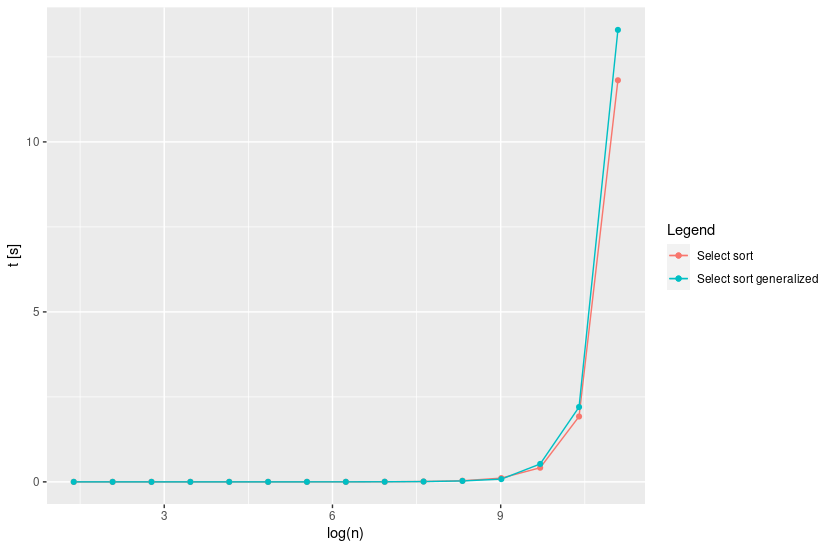
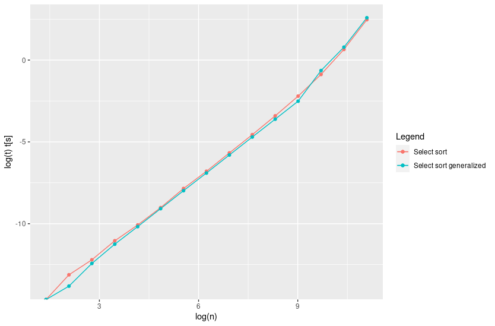
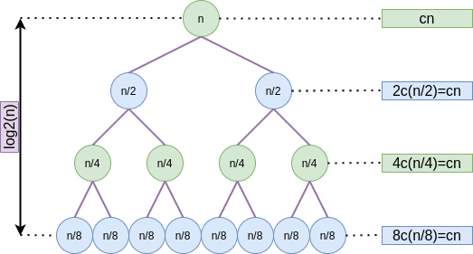
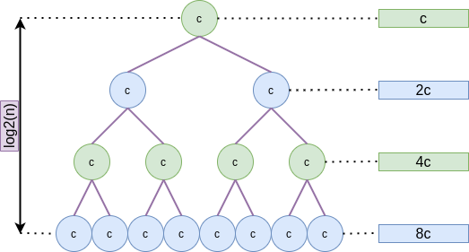
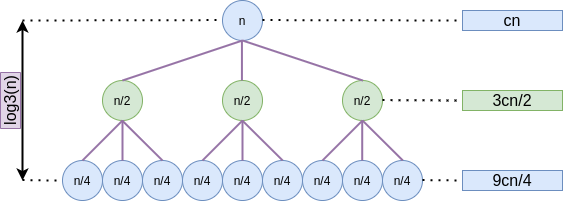

# 05_homework2

Here it can be found a brief explanation about the solution of the practical exercises and the solutions for theoretical exercises. The code can be found on [`AD_sorting_improved`](../../AD_sorting_improved): the modified code is available in the folder [`src`](../../AD_sorting_improved/src), in: `select.c`.

## Exercise 1

**Generalize the $\mathrm{SELECT}$ algorithm to deal also with repeated values and prove that it still belongs to $O(n)$.**

In principle there are no problems with $\mathrm{QUICK\ SORT}$: It is able to sort the array also with the presence of duplicated values. The problem is $\mathsf{Pivot\_selection}$. This function selects a pivot by computing the median on a subset of $A$. This median is computed by sorting this subset and selecting the element "in the middle" by looking at the indexes. If there are repeated values, the median values is no more in the middle, being the provided value of the median wrong.

Let us take a look to the pseudo-code of the main part of $\mathsf{Pivot\_selection}$:
$$
\begin{align}
&\mathrm{FOR}\ c\ \mathrm{IN}\ chuncks	&|c|\ \mathrm{times} \\
& \quad \mathsf{Sort}(c) &\Omega(|c|) \\
& \quad \mathsf{Swap}(c[0], c[|c|/2]) &\Theta(1)
\end{align}
$$
The complexity of the loop is $\Omega(|c|^2)$. The propose is to, in some way, copy one instance of each element of the array in other new array and then compute the mean with the old algorithm over this new array without repetitions. It must be performed without changing the time-complexity of the loop. It can be done by using a new array $I$, that save the indexes of non-repeated values.
$$
\begin{align}
&\mathrm{FOR}\ c\ \mathrm{IN}\ chuncks	&|c|\ \mathrm{times} \\
& \quad \mathsf{Sort}(c) &\Omega(|c|) \\
& \quad j \leftarrow 0 &\Theta(1)\\
& \quad \mathrm{FOR}\ i\ \mathrm{IN}\ |c| 	&|c|\ \mathrm{times}\\
& \quad \quad \mathrm{IF}\ c[i-1] != c[i] 	&\Theta(1)\\
& \quad \quad \quad I[j] \leftarrow i 	&\Theta(1)\\
& \quad \quad \quad j \leftarrow j+1 	&\Theta(1)\\
& \quad \mathsf{Swap}(c[0], c[I[|I|/2]]) &\Theta(1)
\end{align}
$$

The complexity of the loop is $\Omega(|c|^2)$, so if this part of the algorithm does not change, the overall complexity should not change.

## Exercise 2 (performance test)

**Download the latest version of the code from**

https://github.com/albertocasagrande/AD_sorting

**and**

* **Implement the $\mathrm{SELECT}$ algorithm of Ex. 1**
* **Implement a variant of the $\mathrm{QUICK\ SORT}$ algorithm using above-mentioned $\mathrm{SELECT}$ to identify the best pivot for partitioning.**
* **Draw a curve to represent the relation between the input size and the execution-time of the two variants of $\mathrm{QUICK\ SORT}$ (i.e. those of Ex. 2 and Ex. 1 31/3/2020) and discuss about their complexities.**

The code of the exercise can be found at `AD_sorting_improved/src/select.c`. The time-running of the non-generalized version and the generalized one has been represented in the next plots:

As it can be seen, run-times are similar, not being important the introduction of the generalization at this effect. However, time seems more exponential-shape than linear-shape. It could be due to a problem in the select implementation that I did not found yet for lack of time.

## Exercise 3

**In the algorithm $\mathrm{SELECT}$, the input elements are divided into chunks of 5. Will the algorithm work in linear time if they are divided into chunks of 7? What about chunks of 3?**

In principle it should work for these values by the fact that the improvement resides on the idea of separating the array in chunks. The effect that could be observed is a change the order of time in which linear time is reached, from the asymptotic point of view, it is not relevant. However, is important to remember that if is always a change in the "microscopical" structure of the algorithm making impact on a microscopical effect, so it could be values whose effect is irrelevant and other values that produces a huge improvement. For example, if it is taken  element per chunk, the effect will be inexistent since it is the same than non using chunks, however, by using two elements per chunk the effect, also if it could be minimal, should be appreciable.

## Exercise 4

**Suppose that you have a "black-box" worst-case linear-time subroutine to get the position on $A$ of  the value that would be in position $n/2$ if $A$ was sorted. give a simple, linear-time algorithm that solves the selection problem for an arbitrary position $i$.**

Basing on the idea of the bisection algorithm it can be designed a similar algorithm. Let us suppose that the black-box given routine is $\mathsf{ROUTINE}$. A suitable solution could be the next:
$$
\begin{align}
&\mathrm{DEF}\ \mathsf{SELECTION}(A, i) \\
& \quad median\_indx \leftarrow \mathsf{ROUTINE}(A, n) \\
& \quad \mathrm{IF}\ i=n/2 \\
& \quad \quad \mathrm{RETURN}\ A[median\_indx] \\
& \quad A1,\ A2 \leftarrow \mathsf{PARTITION}(A, median\_indx, n) \\
& \quad \mathrm{IF}\ i < n/2 \\
& \quad \quad \mathrm{RETURN}\ \mathsf{SELECTION}(A1, median\_indx) \\
& \quad \mathrm{ELSE} \\
& \quad \quad \mathrm{RETURN}\ \mathsf{SELECTION}(A2, n/2-median\_indx) \\
& \mathrm{ENDDEF}
\end{align}
$$
Obviously the recursion equation would be something like that:
$$
T(n)=T(n/2)+O(n)
$$
By iterating it we can obtain:
$$
T(n)=O(n+n/2+n/4+...)=\sum_{i=0}^l O(n/2^i) 
$$
so
$$
T(n) \leq O(n+n/2+n/4+...)=\sum_{i=0}^\infty O(n/2^i) \leq \\
\leq cn/2 = O(n)
$$

## Exercise 5

**Solve the following recursive equations by using both the recursion tree and the substitution method:**

* $T_1(n)=2T_1(n/2)+O(n)$
* $T_2(n)=T_2([n/2])+T_2([n/2])+\Theta(1)$
* $T_3(n)=3T_3(n/2)+O(n)$
* $T_4(n)=7T_4(n/2)+\Theta(n^2)$

Let us deal with each equation one to the time:

* $T_1(n)=2T_1(n/2)+O(n)$

The recursion tree is the one like this:

In this simple recursion tree it is easy to follow that the time complexity is is the following:
$$
T_1(n)=O(cn\log_2n)=O(n\log n)
$$
It can be also obtained by using the recursion method:
$$
T_1(n)=2T_1(n/2)+O(n) = O(n)+2O(n/2)+2^2O(n/2^2)+2^3O(n/2^3)+...\quad \log_2n\ \mathrm{times} \\
T_1(n)=O(n\log_2n)=O(n\log n)
$$

* $T_2(n)=T_2([n/2])+T_2([n/2])+\Theta(1)$

The recursion tree is the following:

This tree boils down to the expression:
$$
T_2(n)=2T(n/2)+\Theta(1)=\sum_{i=0}^{\log_2n} 2^ic=\frac{c(1-2^{log_2n})}{1/2}=\Theta(n+c)=\Theta(n)
$$
By applying the substitution method:
$$
T_2(n)=2T(n/2)+\Theta(1) = \Theta(1) + 2\Theta(1) + 2^2\Theta(1) + ... \quad \log_2n\ \mathrm{times} \\
T_2(n)=\sum_{i=0}^{\log_2n} 2^ic
$$
Which is the same expression obtained with the recursion tree.

* $T_3(n)=3T_3(n/2)+O(n)$

This tree suggest the equation:
$$
T_3(n)=\sum_{i=0}^{\log_3n} cn\left(\frac{3}{2}\right)^i=cn\frac{1-(3/2)^{\log_3n}}{1-3/2} = O(n·(3/2)^{\log_3n}) = O\left(n\frac{n}{n^{\log_3 2}}\right) =\\
T_3(n)=O(n^{2-\log_3 2}) \approx O(n^{1.37})
$$
With the substitution method we can obtain the same expression:
$$
T_3(n)=3T_3(n/2)+O(n)=O(n)+3O(n/2)+3^2O(n/2^2)+...=\sum_{i=0}^{\log_3n}O(n(3/2)^i)
$$
Which is (in asymptotic terms) the same equation than the one of the tree.

* $T_4(n)=7T_4(n/2)+\Theta(n^2)$

This case is very similar to the previous one: it is enough by changing the 3 by a 7 (the number of edges for each node in the tree), that really does not affect to the time complexity, and the linear term by a quadratic one, providing the next expression:
$$
T_4(n)=\Theta(n^{2-\log_7 2}) \approx \Theta(n^{1.64})
$$
