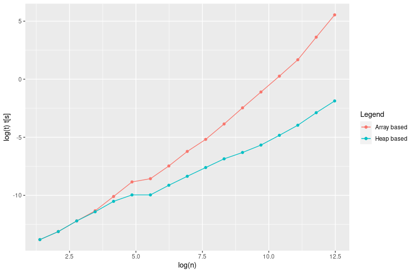

# 08_homework

Here it can be found a brief explanation about the solution of the practical exercises and the solutions for theoretical exercises. The code can be found on [`AD_weighted_graphs_array`](../../AD_weighted_graphs_array) and [`AD_weighted_graphs_heap`](../../AD_weighted_graphs_heap). 

## Exercise 1 (performance test)

* **Implement the array-based version of the Dijkstra's algorithm.**

* **Implement the binary heap-based version of the Dijkstra's algorithm by using the library $\mathsf{binheap}$ that was developed during Lesson 6, Lesson 7, and Lesson 8.**

* **Test the implementations on a set of instances of the problem and compare their execution times.**

  The two implementations has been separated into two similar repositories: [`AD_weighted_graphs_array`](../../AD_weighted_graphs_array) and [`AD_weighted_graphs_heap`](../../AD_weighted_graphs_heap). More details about its implementation and tests can be found into its [`README.md`](../../AD_weighted_graphs_heap/README.md) file. 

  The result of the performance test is the next:

  

It is clear that the improvement on the performance of heap-based version is important. In the second plot it can be also appreciated a change on the behavior respect to the red line, as one can expect.